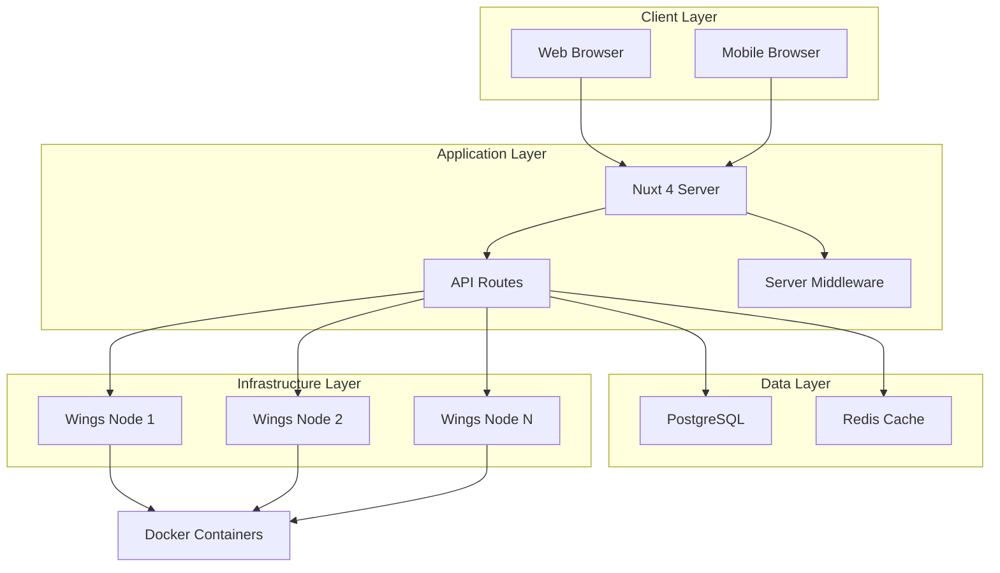
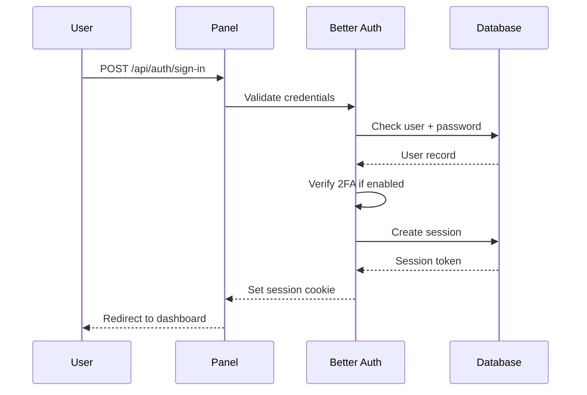

# Architecture

Understand how XyraPanel is built, how its components interact, and the technology decisions that power the platform.

## System Overview

XyraPanel follows a modern full-stack architecture with clear separation of concerns:



## Core Components

### Frontend Application

**Technology Stack:**
- **Nuxt 4**: Vue 3 meta-framework with SSR/SSG capabilities
- **Vue 3.5**: Progressive JavaScript framework with Composition API
- **TypeScript 5.9**: Static type checking and enhanced IDE support
- **Tailwind CSS 4**: Utility-first CSS framework
- **Nuxt UI**: Pre-built component library

**Key Libraries:**
```json
{
  "@xterm/xterm": "^6.0.0",       // Terminal emulator
  "monaco-editor": "^0.55.1",     // Code editor
  "nuxt-charts": "2.1.3",         // Data visualization
  "pinia": "^3.0.4"               // State management
}
```

**File Structure:**
```
app/
├── components/         # Vue components
│   ├── Admin/         # Admin-specific components
│   ├── server/        # Server management components
│   └── ...            # Shared components
├── pages/             # File-based routing
│   ├── admin/         # Admin panel pages
│   ├── server/        # Server management pages
│   ├── account/       # User account pages
│   └── auth/          # Authentication pages
├── layouts/           # Layout components
└── app.vue            # Root component
```

### Backend API

**Framework:**
- **Nitro**: Universal server engine for Nuxt
- **H3**: HTTP framework for event handlers

**API Structure:**
```
server/
├── api/
│   ├── admin/         # Admin API endpoints
│   ├── client/        # Client server management
│   ├── servers/       # Server operations
│   ├── account/       # User account management
│   ├── auth/          # Authentication
│   ├── wings/         # Wings node communication
│   └── remote/        # Remote Wings callbacks
├── middleware/        # Request middleware
├── utils/            # Helper functions
└── database/         # Database configuration
```

**Example API Handler:**

From the API route structure, here's how server power management works:

```typescript
// server/api/servers/[id]/power.post.ts
export default defineEventHandler(async (event) => {
  const serverId = getRouterParam(event, 'id');
  const { action } = await readBody(event);
  
  // Validate user permissions
  const user = await requireAuth(event);
  await requireServerAccess(user, serverId, 'control.power');
  
  // Get server and node details
  const server = await getServer(serverId);
  const node = await getWingsNode(server.nodeId);
  
  // Send power command to Wings
  const wingsClient = createWingsClient(node);
  await wingsClient.setPowerState(server.uuid, action);
  
  // Log activity
  await logActivity(user.id, 'server.power', { serverId, action });
  
  return { success: true };
});
```

### Database Layer

**PostgreSQL Schema:**

XyraPanel uses Drizzle ORM for type-safe database access. Key tables include:

<CardGroup cols={2}>
  <Card title="users" icon="user">
    User accounts, authentication, roles, and suspension status
  </Card>
  <Card title="sessions" icon="clock">
    Active user sessions with device and IP tracking
  </Card>
  <Card title="wingsNodes" icon="server">
    Wings daemon configurations and connection details
  </Card>
  <Card title="servers" icon="gamepad">
    Game server definitions, resource limits, and state
  </Card>
  <Card title="serverAllocations" icon="network-wired">
    IP addresses and ports assigned to servers
  </Card>
  <Card title="eggs" icon="egg">
    Server templates with startup commands and variables
  </Card>
  <Card title="schedules" icon="calendar">
    Automated task schedules with cron expressions
  </Card>
  <Card title="backups" icon="database">
    Backup metadata and storage locations
  </Card>
  <Card title="activityLogs" icon="list">
    Audit trail of all panel actions
  </Card>
</CardGroup>

**Schema Example:**

From `server/database/schema.ts`:

```typescript
export const wingsNodes = pgTable(
  'wings_nodes',
  {
    id: text('id').primaryKey(),
    uuid: text('uuid').notNull(),
    name: text('name').notNull(),
    description: text('description'),
    baseUrl: text('base_url').notNull(),
    fqdn: text('fqdn').notNull(),
    scheme: text('scheme', { enum: ['http', 'https'] }).notNull(),
    public: boolean('public').notNull().default(true),
    maintenanceMode: boolean('maintenance_mode').notNull().default(false),
    memory: integer('memory').notNull(),
    memoryOverallocate: integer('memory_overallocate').notNull().default(0),
    disk: integer('disk').notNull(),
    diskOverallocate: integer('disk_overallocate').notNull().default(0),
    uploadSize: integer('upload_size').notNull().default(100),
    daemonBase: text('daemon_base').notNull(),
    daemonListen: integer('daemon_listen').notNull().default(8080),
    daemonSftp: integer('daemon_sftp').notNull().default(2022),
    tokenIdentifier: text('token_identifier').notNull(),
    tokenSecret: text('token_secret').notNull(),
    apiToken: text('api_token').notNull(),
    locationId: text('location_id').references(() => locations.id),
    lastSeenAt: timestamp('last_seen_at', { mode: 'string' }),
    createdAt: timestamp('created_at', { mode: 'string' }).notNull(),
    updatedAt: timestamp('updated_at', { mode: 'string' }).notNull(),
  },
  (table) => [
    uniqueIndex('wings_nodes_base_url_unique').on(table.baseUrl),
    uniqueIndex('wings_nodes_uuid_unique').on(table.uuid),
  ],
);
```

### Redis Cache

Redis provides high-performance caching and session storage:

**Configuration:**

From `nuxt.config.ts`:

```typescript
const baseRedisConfig = {
  host: process.env.REDIS_HOST || (isDev ? 'localhost' : 'redis'),
  port: process.env.REDIS_PORT ? Number.parseInt(process.env.REDIS_PORT) : 6379,
  username: process.env.REDIS_USERNAME,
  password: process.env.REDIS_PASSWORD,
};

nitro: {
  storage: {
    cache: {
      driver: 'redis',
      ...redisStorageConfig,
    },
  },
}
```

**Use Cases:**
- **Rate Limiting**: Track API request counts per IP
- **Session Storage**: Distributed session management
- **HTTP Caching**: Cache API responses for performance
- **Resource Metrics**: Store real-time server statistics

## Security Architecture

### Authentication Flow

XyraPanel uses Better Auth for modern authentication:



**Features:**
- Password hashing with bcryptjs
- JWT tokens for API authentication
- Session tokens with expiration
- TOTP-based two-factor authentication
- Password reset via email tokens

### Authorization Model

Permissions are checked at multiple levels:

1. **Route-Level**: Middleware checks user authentication
2. **Resource-Level**: Verify ownership/access to specific resources
3. **Action-Level**: Check permissions for specific operations

**Permission Example:**
```typescript
// Check if user can access server console
await requireServerAccess(user, serverId, 'control.console');

// Check if user is root admin
await requireRootAdmin(user);

// Check if user owns resource
await requireOwnership(user, resourceId);
```

### Rate Limiting

Multi-layer rate limiting protects against abuse:

<Info>
  **Rate Limiter Configuration**
  
  XyraPanel uses different rate limits for different endpoints:
  - **Authentication**: 5 requests per 10 minutes
  - **Password Reset**: 5 requests per 15 minutes
  - **General API**: 150 requests per 5 minutes
  - **Admin API**: 300 requests per minute
</Info>

From `nuxt.config.ts`:

```typescript
routeRules: {
  '/api/auth/sign-in/**': {
    security: {
      rateLimiter: {
        tokensPerInterval: 5,
        interval: 600000, // 10 minutes
        throwError: true,
      },
    },
  },
  '/api/admin/**': {
    security: {
      rateLimiter: {
        tokensPerInterval: 300,
        interval: 60000, // 1 minute
        throwError: true,
      },
    },
  },
}
```

### Content Security Policy

Strict CSP headers prevent XSS and injection attacks:

```typescript
contentSecurityPolicy: {
  'default-src': ["'self'"],
  'connect-src': ["'self'", 'https:', 'wss:', 'ws:'],
  'img-src': ["'self'", 'data:', 'https:', 'blob:'],
  'style-src': ["'self'", 'https:', "'unsafe-inline'"],
  'font-src': ["'self'", 'https:', 'data:'],
  'script-src': ["'strict-dynamic'", "'nonce-{{nonce}}'", "'self'", 'https:'],
  'frame-src': ["'self'", 'https://challenges.cloudflare.com'],
  'object-src': ["'none'"],
  'base-uri': ["'self'"],
  'form-action': ["'self'"],
  'frame-ancestors': ["'none'"],
  'upgrade-insecure-requests': true,
}
```

## Wings Communication

### Protocol

XyraPanel communicates with Wings nodes via HTTP API:

**Wings Client Implementation:**

From `server/utils/wings/client.ts`:

```typescript
export function createWingsClient(node: WingsNodeConnection) {
  const baseUrl = `${node.scheme}://${node.fqdn}:${node.daemonListen}`;
  
  async function request<T>(path: string, options: RequestOptions) {
    const url = `${baseUrl}${path}`;
    const authToken = formatAuthToken(node.tokenId, node.tokenSecret);
    
    const headers: Record<string, string> = {
      Accept: 'application/json',
      'Content-Type': 'application/json',
      Authorization: `Bearer ${authToken}`,
      ...options.headers,
    };
    
    const response = await fetch(url, {
      method: options.method || 'GET',
      headers,
      body: options.body ? JSON.stringify(options.body) : undefined,
    });
    
    if (!response.ok) {
      const error = await response.text();
      throw new Error(`Wings API error: ${response.status} - ${error}`);
    }
    
    return response.json();
  }
  
  return {
    getServerDetails: (uuid: string) => 
      request(`/api/servers/${uuid}`, { method: 'GET' }),
    setPowerState: (uuid: string, action: string) => 
      request(`/api/servers/${uuid}/power`, { method: 'POST', body: { action } }),
    sendCommand: (uuid: string, command: string) => 
      request(`/api/servers/${uuid}/command`, { method: 'POST', body: { command } }),
    // ... more operations
  };
}
```

### WebSocket Connections

Real-time console access uses WebSocket proxying:

1. Client connects to panel WebSocket endpoint
2. Panel authenticates user and validates server access
3. Panel establishes WebSocket to Wings node
4. Messages are proxied bidirectionally
5. Console output streams to client in real-time

```typescript
// server/api/client/servers/[server]/websocket.get.ts
export default defineWebSocketHandler({
  async open(peer) {
    const { server, user } = await validateAccess(peer);
    const wingsWs = await connectToWings(server);
    
    // Proxy messages between client and Wings
    peer.subscribe(`server:${server.uuid}`);
    wingsWs.on('message', (data) => peer.send(data));
    peer.on('message', (data) => wingsWs.send(data));
  },
});
```

## Background Tasks

### Scheduled Jobs

Nitro's experimental tasks feature handles background processing:

From `nuxt.config.ts`:

```typescript
scheduledTasks: {
  '* * * * *': ['scheduler:process'],                    // Every minute
  '*/2 * * * *': ['monitoring:collect-resources'],       // Every 2 minutes
  '0 * * * *': ['maintenance:prune-rate-limits'],        // Hourly
  '0 2 * * *': [                                         // Daily at 2 AM
    'maintenance:prune-audit-logs',
    'maintenance:prune-sessions',
    'maintenance:prune-tokens',
    'maintenance:prune-backups',
  ],
  '0 3 * * 0': ['maintenance:prune-transfers'],          // Weekly
}
```

<Warning>
  Nitro tasks are experimental. XyraPanel will remain in beta until this feature is stable. See [Nitro Issue #1105](https://github.com/nuxt/nitro/issues/1105).
</Warning>

**Task Types:**

- **scheduler:process**: Execute user-defined server schedules
- **monitoring:collect-resources**: Gather CPU/memory/disk metrics from Wings
- **maintenance:prune-***: Clean up old records for database health

## Deployment Architecture

### Single-Server Deployment

Simplest setup for small deployments:

```
┌─────────────────────────────────┐
│      Single Server              │
│                                 │
│  ┌──────────────────────────┐  │
│  │  XyraPanel (Node.js)     │  │
│  │  - Nuxt Application      │  │
│  │  - PM2 Process Manager   │  │
│  └──────────────────────────┘  │
│                                 │
│  ┌──────────────────────────┐  │
│  │  PostgreSQL Database     │  │
│  └──────────────────────────┘  │
│                                 │
│  ┌──────────────────────────┐  │
│  │  Redis Cache             │  │
│  └──────────────────────────┘  │
│                                 │
│  ┌──────────────────────────┐  │
│  │  Wings Daemon            │  │
│  └──────────────────────────┘  │
└─────────────────────────────────┘
```

### Multi-Server Deployment

Scalable architecture for production:

```
┌──────────────────┐
│  Load Balancer   │
└────────┬─────────┘
         │
    ┌────┴────┐
    │         │
┌───▼───┐ ┌──▼────┐
│Panel 1│ │Panel 2│  (Multiple Nuxt instances)
└───┬───┘ └──┬────┘
    │        │
    └───┬────┘
        │
   ┌────┴─────┐
   │          │
┌──▼──┐   ┌──▼──┐
│ PG  │   │Redis│  (Shared data layer)
└─────┘   └─────┘
     │
     └─────┬─────────┬─────────┐
           │         │         │
       ┌───▼───┐ ┌──▼────┐ ┌──▼────┐
       │Wings 1│ │Wings 2│ │Wings N│
       └───────┘ └───────┘ └───────┘
```

### Docker Deployment

XyraPanel includes Docker Compose configuration:

```yaml
services:
  panel:
    image: xyrapanel/panel:latest
    environment:
      DATABASE_URL: postgresql://...
      REDIS_HOST: redis
    depends_on:
      - postgres
      - redis
  
  postgres:
    image: postgres:17
    volumes:
      - pg_data:/var/lib/postgresql/data
  
  redis:
    image: redis:7-alpine
```

## Performance Optimizations

### Code Splitting

Automatic chunking reduces initial load time:

From `nuxt.config.ts`:

```typescript
vite: {
  build: {
    rollupOptions: {
      output: {
        manualChunks(id) {
          if (id.includes('@xterm')) return 'xterm';
          if (id.includes('monaco-editor')) return 'monaco';
          if (id.includes('echarts')) return 'echarts';
          if (id.includes('node_modules/vue/')) return 'vendor';
        }
      },
    },
  },
}
```

### HTTP Caching

Intelligent cache headers reduce database load:

```typescript
runtimeConfig: {
  httpCache: {
    enabled: true,
    defaultMaxAge: 5,           // Cache for 5 seconds
    defaultSwr: 15,             // Stale-while-revalidate for 15s
    dashboardMaxAge: 10,        // Dashboard: 10s cache
    dashboardSwr: 30,           // Dashboard: 30s SWR
  },
}
```

### Build Optimization

- **Lightning CSS**: Fast CSS minification and processing
- **Tree Shaking**: Remove unused code from bundles
- **Rolldown Vite**: Experimental faster bundler (via pnpm override)
- **Build Cache**: Reuse builds across deployments

## Technology Stack Summary

<CardGroup cols={2}>
  <Card title="Frontend" icon="window">
    - Nuxt 4.3
    - Vue 3.5
    - TypeScript 5.9
    - Tailwind CSS 4
    - Nuxt UI 4.5
  </Card>
  <Card title="Backend" icon="server">
    - Nitro (Nuxt Server)
    - H3 Event Handlers
    - Drizzle ORM 0.45
    - Better Auth 1.4
  </Card>
  <Card title="Database" icon="database">
    - PostgreSQL (primary)
    - Redis (cache + sessions)
    - Drizzle Kit (migrations)
  </Card>
  <Card title="Infrastructure" icon="cloud">
    - Pterodactyl Wings
    - Docker containers
    - PM2 process manager
    - Nginx/Caddy (reverse proxy)
  </Card>
  <Card title="Security" icon="shield">
    - bcryptjs (password hashing)
    - jose (JWT tokens)
    - nuxt-security (headers)
    - Turnstile/reCAPTCHA
  </Card>
  <Card title="Developer Tools" icon="wrench">
    - oxlint (linting)
    - oxfmt (formatting)
    - Vitest (testing)
    - TSX (TypeScript execution)
  </Card>
</CardGroup>

## Next Steps

Now that you understand XyraPanel's architecture:

- [Installation](/getting-started/installation) - Deploy your own instance
- [Configuration](/configuration/environment-variables) - Configure environment variables
- [Development](/getting-started/installation) - Set up local development
- [API Reference](/api/overview) - Explore the API endpoints