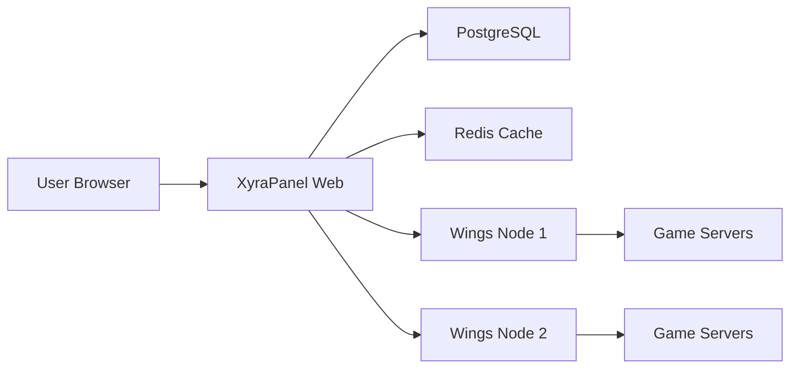

# Introduction to XyraPanel

XyraPanel is an open-source game server management panel built on Nuxt, TypeScript, and PostgreSQL. It provides a modern, secure, and scalable solution for managing game servers, with full compatibility with Pterodactyl Wings.

<Note>
  XyraPanel is currently in **Early Access** (version 0.1.0-alpha.3) and under active development. APIs, UI, and behavior are subject to change. It is not recommended for production use yet.
</Note>

## What is XyraPanel?

XyraPanel is a comprehensive game server management platform that allows you to:

- **Manage Game Servers**: Deploy, configure, and control game servers from a unified dashboard
- **Monitor Resources**: Track CPU, memory, disk usage, and network statistics in real-time
- **Control Access**: Manage users, permissions, and authentication with advanced security features
- **Automate Tasks**: Create schedules, backups, and automated workflows
- **Scale Infrastructure**: Deploy across multiple nodes and locations

<CardGroup cols={2}>
  <Card title="Modern Architecture" icon="code">
    Built with Nuxt 4, Vue 3, TypeScript, and Tailwind CSS for a fast, responsive experience
  </Card>
  <Card title="Pterodactyl Compatible" icon="server">
    Works seamlessly with existing Pterodactyl Wings installations
  </Card>
  <Card title="Security First" icon="shield">
    Features 2FA, API key management, rate limiting, and comprehensive audit logs
  </Card>
  <Card title="Open Source" icon="github">
    MIT licensed and community-driven development on GitHub
  </Card>
</CardGroup>

## Key Benefits

### Developer-Friendly

XyraPanel is built with modern web technologies that developers love:

- **TypeScript**: Full type safety across the entire stack
- **Nuxt 4**: Server-side rendering, API routes, and file-based routing
- **Drizzle ORM**: Type-safe database queries with PostgreSQL
- **Better Auth**: Modern authentication with session management

### Production-Ready Features

Despite being in early access, XyraPanel includes enterprise-grade features:

- **Redis Caching**: High-performance caching layer for reduced database load
- **Rate Limiting**: Configurable rate limits per endpoint with Redis or LRU cache
- **Content Security Policy**: Strict CSP headers with nonce-based script execution
- **PWA Support**: Progressive Web App capabilities for mobile access
- **Internationalization**: Multi-language support with i18n integration

### Easy Deployment

Get started quickly with minimal setup:

```bash
bash <(curl -fsSL https://xyrapanel.com/install)
```

The one-line installer handles everything for Ubuntu 22.04/24.04 systems.

## Use Cases

<CardGroup cols={3}>
  <Card title="Game Hosting" icon="gamepad">
    Host Minecraft, CS:GO, Rust, and other popular game servers
  </Card>
  <Card title="Development Teams" icon="users">
    Provide team members with isolated development servers
  </Card>
  <Card title="Community Servers" icon="heart">
    Run community gaming servers with user management
  </Card>
</CardGroup>

## Architecture Overview

XyraPanel consists of three main components:

1. **Panel** (Nuxt Application): The web interface for server management
2. **Database** (PostgreSQL): Stores all configuration and state
3. **Wings** (Pterodactyl): Manages Docker containers on remote nodes



## Community & Support

<CardGroup cols={2}>
  <Card title="Documentation" icon="book" href="https://xyrapanel.com">
    Comprehensive guides and API reference
  </Card>
  <Card title="Discord Community" icon="discord" href="https://xyrapanel.com/discord">
    Join the community for help and discussions
  </Card>
  <Card title="GitHub Repository" icon="github" href="https://github.com/XyraPanel/panel">
    Contribute code, report issues, and track development
  </Card>
  <Card title="Crowdin Translations" icon="language" href="https://crowdin.com/project/xyrapanel">
    Help translate XyraPanel into your language
  </Card>
</CardGroup>

## Next Steps

Ready to get started? Check out these resources:

- [Features Overview](/features) - Explore what XyraPanel can do
- [Architecture](/architecture) - Understand how XyraPanel works
- [Installation Guide](/getting-started/installation) - Deploy your own instance
- [Quick Start](/getting-started/first-server) - Create your first server

<Warning>
  Remember that XyraPanel is under active development. Always back up your data and test updates in a staging environment before deploying to production.
</Warning>